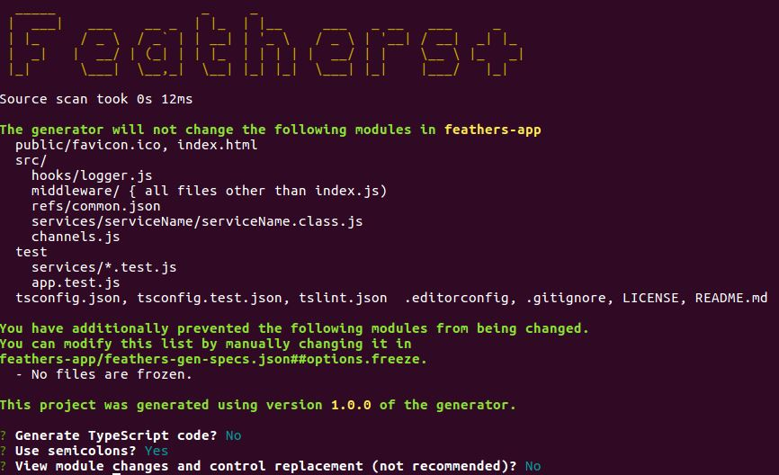
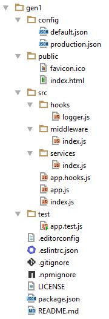

# Quick-start

::: danger STOP
Until the generator is released, all references in the documentation to `@feathers-plus`
should be replaced with `@feathers-x`.
:::

## Installation

`npm i -g @feathers-plus/cli`

::: danger STOP
`generator-feathers-plus` is not automatically installed as a dependency
during the development period.

Do the following so that any change you make in @feathers-plus/generator-feathers-plus
will be immediately reflected in @feathers-plus/cli.

- Clone `@feathers-plus/generator-feathers-plus`.
- [Symlink](https://medium.com/trisfera/the-magic-behind-npm-link-d94dcb3a81af)
it into @feathers-plus/cli.
  - In @feathers-plus/generator-feathers-plus, run `npm link`.
  - In @feathers-plus/cli, run `npm link @feathers-plus/generator-feathers-plus`.
  The location containing the global @feathers-plus/cli will vary based on your OS.
  You can run `npm list -g` to see where global libraries are installed.
:::

## Comparision to @feathersjs/cli

@feathers-plus/cli, a.k.a. "cli-plus", is similar to @feathersjs/cli in that:
- It uses the same commends, e.g. `generate service`.
- It prompts with the same questions, e.g. "Which path should the service be registered on?"
- It generates the same modules with essentially identical code.

However with cli-plus also:
- Converts DB-agnostic JSON-schema models to the DB model each service is currently configured for. 
- Generates all the code needed for your GraphQL Query interface.
- Generates either JavaScript or TrueScript code; with semicolons or without. Converts apps between JS and TS.
- Regenerates you app without losing changes you've made. You stay up-to-date with enhancements and fixes.

## What the Generator Does

We've been writing code "by hand" in order to understand how basic Feathers works.
We will now start using Feathers generators since we have the background to understand what they produce.

#### Generators help eliminate boilerplate.

We've seen that Feathers, even when coded "by hand",
eliminates the majority of the boilerplate typically in a CRUD project.
Generators will eliminate even more.

:::tip Generators.
Feathers generators produce very little code because Feathers is so succinct.
You can easily understand the generated code because its no different from what we've been
coding "by hand" so far.
Some other frameworks make things “seem” easy by generating thousands of lines of code for you
and, in the process, making it almost impossible to implement anything not supported out of the box
by their generators.
:::

#### Generators structure your app.

The generated modules are structured as recommended by the Feathers team.

#### Generators handle database specifics.

The generators will generate code for different databases
so you don't have to investigate how to do so.

:::tip Switching between adapters.
You can change a service's database adapter while regenerating it.
This allows you, for example, to quickly mock up an app using the NeDB adapter,
and then convert it to Mongoose.
:::

## generate options

Let's generate a project having users who may be members of one or more teams.
We want to display teams with all their members

We first create a folder to contain the app, and then set its generator options.

```text
mkdir feathers-app
cd feathers-app
feathers-plus generate options
```

#### Prompts



- `Source scan took 0s 23ms`.
The generator scans the app to identify any custom code.
This will always be very fast,
taking much less time than what the `Yoeman` tool needs to start up.

- `The generator will not change the following modules`.
The generator can refresh many of the modules in your app,
updating them to the latest version of the generator.
It does this without changing any of your custom code.

The listed modules are ones which the generator will not update.
Once they are written, the generator will not refresh them.
Any changes you make will remain.
If you delete any of them, the generator will replace them.

This list is displayed as a convenience, so you can refer to it anytime by running
`generate options` and cancelling.

- `You have additionally prevented the following modules from being changed.`
You can prevent a.k.a. "freeze" modules to prevent the generator from refreshing them.
You normally would not do so but its useful to have the option.
The frozen modules are listed here for convenience.

- `Generate TypeScript code?` Defaults to no. Otherwise JavaScript code is generated.

- `Use semicolons?` Defaults to yes. Otherwise semicolons are not generated at the end of statements.

- `View module changes and control replacement (not recommended)?`
Defaults to no.
This is a Yeoman feature which allows you to inspect the changes to be made to any module,
and to decide whether to apply it.
Its useful when you are exploring the raw details of what the generator writes.

#### Directory

The feathers-app directory now contains one module.


#### feathers-gen-specs.json

```js
{
  "options": {
    "ver": "1.0.0",
    "inspectConflicts": false,
    "semicolons": true,
    "freeze": [],
    "ts": false
  },
  "app": {},
  "services": {}
}
```

The generator keeps the prompts used to generate the app in `feathers-gen-specs.json`.
It can regenerate your entire app from that and the custom code it finds in the modules.

:::tip Regeneration.
The generator will default to your previous choices if you rerun `feathers-plus generate options`.
It will make any needed changes to all modules if you change any of the options.
:::

:::tip Optional
You need not run `feathers-plus generate options` if your app will be in JavaScript with semicolons.
:::

## generate app

Next we generate the scaffolding for the app.

```text
feathers-plus generate app
```

#### Prompts


The generator creates some
[JS modules](https://github.com/feathersjs-x/generator-feathers-plus/blob/master/examples/js/02-app/feathers-app/)
or [TS ones](https://github.com/feathersjs-x/generator-feathers-plus/blob/master/examples/ts/02-app/feathers-app/)
reflecting your choices.
The modules are properly wired together and structured as recommended by the Feathers team.

#### Directory

The app directory has now filled in.
Below are the previous and the new contents when JavaScript is generated.


and when TypeScript is generated.


#### feathers-gen-specs.json

```js
{
  "options": {
    "ver": "1.0.0",
    "inspectConflicts": false,
    "semicolons": true,
    "freeze": [],
    "ts": false
  },
  "app": {
    "name": "feathers-app",
    "description": "Quick start example app.",
    "src": "src",
    "packager": "npm@>= 3.0.0",
    "providers": [
      "rest",
      "socketio"
    ]
  },
  "services": {}
}
```

#### config/default.json

```js
{
  "host": "localhost",
  "port": 3030,
  "public": "../public/",
  "paginate": {
    "default": 10,
    "max": 50
  }
}
```

The generator creates some
[modules](https://github.com/feathersjs/feathers-docs/blob/master/examples/step/02/gen1/)
reflecting your choices.
The modules are properly wired together and structured as recommended by the Feathers team.

They are mostly [boilerplate](https://en.wikipedia.org/wiki/Boilerplate_code)
and organized as follows:



### Generated modules

#### config/
 
Contains the configuration files for the app.
[production.json](https://github.com/feathersjs/feathers-docs/blob/master/examples/step/02/gen1/config/production.json)
values override
[default.json](https://github.com/feathersjs/feathers-docs/blob/master/examples/step/02/gen1/config/default.json)
ones when in production mode,
i.e. when you run `NODE_ENV=production node path/to/your/server.js`.

#### node_modules/

The generator installs the project dependencies here using either
[npm](https://docs.npmjs.com/), or [yarn](https://yarnpkg.com/en/) if that's installed.
The dependencies are enumerated in `package.json`.

#### public/
 
Contains the resources to be served.
A sample favicon and
[HTML file](https://github.com/feathersjs/feathers-docs/blob/master/examples/step/02/gen1/public/index.html)
are included.

#### src/
 
Contains the Feathers server.
    
- **hooks/** contains your custom hooks,
usually those general enough to be used with multiple services.
A simple but useful
[logger](https://github.com/feathersjs/feathers-docs/blob/master/examples/step/02/gen1/src/hooks/logger.js)
is provided as an example.
    
- **middleware/** contains your Express middleware.
    
- **services/** will contain the services.

- [index.js](https://github.com/feathersjs/feathers-docs/blob/master/examples/step/02/gen1/src/index.js)
is used by node to start the app.
    
- [app.js](https://github.com/feathersjs/feathers-docs/blob/master/examples/step/02/gen1/src/app.js)
configures Feathers and Express.

- [app.hooks.js](https://github.com/feathersjs/feathers-docs/blob/master/examples/step/02/gen1/src/app.hooks.js)
contains hooks which have to run for **all** services.
**We have not covered this capability before.**
You can configure such hooks
[like this.](https://github.com/feathersjs/feathers-docs/blob/master/examples/step/02/gen1/src/app.js#L43)
 
#### test/

Contains the tests for the app.
[app.test.js](https://github.com/feathersjs/feathers-docs/blob/master/examples/step/02/gen1/test/app.test.js)
tests that the index page appears, as well as 404 errors for HTML pages and JSON.

#### [.editorconfig](https://github.com/feathersjs/feathers-docs/blob/master/examples/step/02/gen1/.editorconfig)
is compatible with the [EditorConfig project](http://editorconfig.org/)
and helps developers define and maintain consistent coding styles among different editors and IDEs.

#### [.eslintrc.json](https://github.com/feathersjs/feathers-docs/blob/master/examples/step/02/gen1/.eslintrc.json)
contains defaults for liniting your code with
[ESLint](http://eslint.org/docs/user-guide/getting-started).

#### [.gitignore](https://github.com/feathersjs/feathers-docs/blob/master/examples/step/02/gen1/.gitignore)
specifies
[intentionally untracked files](https://git-scm.com/docs/gitignore)
which
[git](https://git-scm.com/),
[GitHub](https://github.com/)
and other similar projects ignore.

#### [.npmignore](https://github.com/feathersjs/feathers-docs/blob/master/examples/step/02/gen1/.npmignore)
specifies
[files which are not to be published](https://docs.npmjs.com/misc/developers#keeping-files-out-of-your-package)
for distribution.

#### [LICENSE](https://github.com/feathersjs/feathers-docs/blob/master/examples/step/02/gen1/LICENSE)
contains the [license](https://docs.npmjs.com/files/package.json#license)
so that people know how they are permitted to use it, and any restrictions you're placing on it.

It defaults to the Feathers license.

#### [package.json](https://github.com/feathersjs/feathers-docs/blob/master/examples/step/02/gen1/package.json)
contains [information](https://docs.npmjs.com/files/package.json)
which
[npm](https://docs.npmjs.com/),
[yarn](https://yarnpkg.com/en/)
and other package managers need to install and use your package.

### What's next?

The generated code will look familiar.
It contains nothing more than what we have covered previously.
The main advantages of the Feathers generators are

- Generators structure your app.
The generated modules are structured as recommended by the Feathers team.

- Generators write the repetitive boilerplate
so you don't have to.

- Generators handle database specifics.
The generators will generate code for different databases
so you don't have to investigate how to do so.
